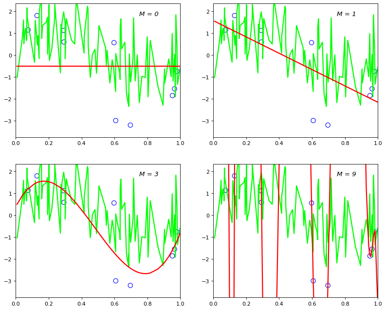
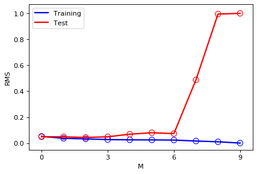
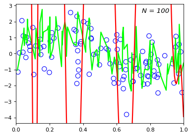
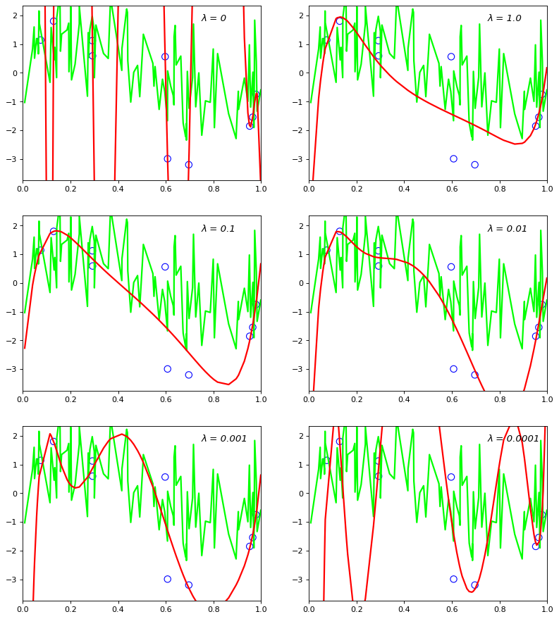
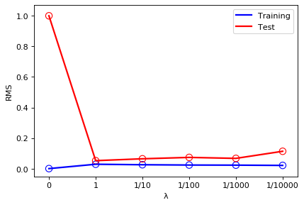

```python
#
# Zacary Cotton
# 100 103 1997
# CSE 5334 - Data Mining
# Assignment 1
#

import math, random
import numpy as np
import matplotlib.pyplot as plt

from sklearn.preprocessing import PolynomialFeatures, StandardScaler
from sklearn.metrics import mean_squared_error
from sklearn.pipeline import make_pipeline
from sklearn.linear_model import Ridge


def Generate_Xs(count):
    
    Xs = []
    for i in range(count):
        x = random.uniform(0, 1)
        Xs.append(x)
    Xs = np.sort(np.asarray(Xs))
    
    return Xs


def Generate_Ys(Xs):
    
    Y = []
    for x in Xs:
        N = random.gauss(0, 1)
        y = math.sin(2*math.pi*x) + N
        Y.append(y)
    Y = np.asarray(Y)
    
    return Y


class Figure_Prediction_vs_Truth:
    
    def __init__(self, subplot_row_count, x_plot, y_plot, x_train, y_train):
        
        self.x_plot = x_plot
        self.y_plot = y_plot
        
        self.x_train = x_train
        self.y_train = y_train
        
        self.subplot_row_count = subplot_row_count
        self.subplot_empty_spot = 0
        
        if self.subplot_row_count == 2: figure_size = (12, 10)
        elif self.subplot_row_count == 3: figure_size = (12, 14)
        else: figure_size = (12, 4)
        
        self.figure = plt.figure(num=None, figsize=figure_size, dpi=80, facecolor='w', edgecolor='k')
        
        return
    
    
    
    def Add_Subplot(self, title, y_pred):
        
        self.subplot_empty_spot += 1
        subplot = self.figure.add_subplot(self.subplot_row_count, 2, self.subplot_empty_spot)
        
        subplot.text(.75, max(self.y_train), title, style='italic', fontsize=12)
        subplot.axis([0, 1, min(self.y_train)-.55, max(self.y_train)+.55])
        
        subplot.plot(self.x_plot, self.y_plot, color='lime', linewidth=2)
        
        subplot.scatter(self.x_train, self.y_train, s=70, facecolors='none', edgecolors='blue', marker='o')
    
        subplot.plot(self.x_plot, y_pred, color='red', linewidth=2)
        
        return


def RMSE_toFind_Weights_ofRegression(chart_orders, x_plot, y_plot, x_train, y_train, x_test, y_test):
    
    weights = []; rmse_train = []; rmse_test = []
    Degree_Figure = Figure_Prediction_vs_Truth(2, x_plot, y_plot, x_train, y_train)
    for degree in range(10):
        
        model = make_pipeline(StandardScaler(), PolynomialFeatures(degree), Ridge(alpha=0, fit_intercept=True, solver='svd'))
        model.fit(x_train[:, np.newaxis], y_train)
        
        y_pred = model.predict(x_train[:, np.newaxis])
        rmse_train.append(math.sqrt(mean_squared_error(y_train, y_pred)))    
        
        y_pred = model.predict(x_plot[:, np.newaxis])
        w = [model.steps[2][1].intercept_.tolist()]
        w.extend(model.steps[2][1].coef_[1:].tolist())
        weights.append((degree, w))
        
        if degree in chart_orders: Degree_Figure.Add_Subplot('M = ' + str(degree), y_pred)
        
        if degree == 9: Ninth_Order_Prediction = y_pred
        
        y_pred = model.predict(x_test[:, np.newaxis])
        rmse_test.append(math.sqrt(mean_squared_error(y_test, y_pred)))
    
    return weights, rmse_train, rmse_test, Ninth_Order_Prediction


def Display_WeightsTable(print_orders, weights):
    
    p_str = ''
    
    print_weights = []
    for weight in weights:
        if weight[0] in print_orders:
            if weight[0] == print_orders[-1]: cap = len(weight[1])
            if weight[0] == print_orders[0]: p_str += ' '*8
            else: p_str += ' '*5
            p_str += ('M = ' + str(weight[0]))
            if weight[0] == print_orders[1]: weight[1][0] += 1
            print_weights.append(weight[1])
    
    p_str += ('\n' + '-'*(len(p_str)+4) + '\n')
    
    for i in range(cap):
        w_spacing = ('w' + str(i) + '|')
        p_str += w_spacing
        w_spacing = len(w_spacing)
        for index, weight in enumerate(print_weights):
            try:
                fi = 7; fd = 3; max_len = fi + fd
                f_str = '{:' + str(fi) + '.' + str(fd) + 'f}'
                w = f_str.format(weight[i])
                
                while len(w) > max_len-1 and fd > 0:
                    fd -= 1; f_str = '{:' + str(fi) + '.' + str(fd) + 'f}'
                    w = f_str.format(weight[i])
                
                if index == 0: p_str += ' '*w_spacing
                elif len(w) > 6: p_str += ' '*w_spacing
                else: p_str += ' '*4
                
                p_str += w
                
            except: p_str += ' '*10
        p_str += '\n'
    
    print(p_str)
    
    return


def Draw_TrainError_vs_TestError(test_type, rms_train, rms_test):
    
    rms_train = [rms/max(rms_test) for rms in rms_train]
    rms_test = [rms/max(rms_test) for rms in rms_test]
    
    figure = plt.figure(num=None, figsize=(6, 4), dpi=80, facecolor='w', edgecolor='k').add_subplot()
    figure.set_xlabel(test_type); figure.set_ylabel('RMS')
    
    figure.plot(range(len(rms_train)), rms_train, color='blue', linewidth=2, label='Training')
    figure.scatter(range(len(rms_train)), rms_train, s=70, facecolors='none', edgecolors='blue', marker='o')
    figure.plot(range(len(rms_test)), rms_test, color='red', linewidth=2, label='Test')
    figure.scatter(range(len(rms_test)), rms_test, s=70, facecolors='none', edgecolors='red', marker='o')
    
    if test_type == 'M':
        figure.set_xticks(np.arange(0, 10, 3))
        figure.set_yticks(np.arange(0.0, 1.2, .2))
        figure.legend(loc='upper left')
    
    elif test_type == 'λ':
        plt.xticks(range(len(rms_test)), ['0','1','1/10','1/100','1/1000','1/10000'])
        figure.set_yticks(np.arange(0.0, 1.2, .2))
        figure.legend(loc='upper right')
    
    return


def Regularize_Using_Sum_ofWeights(Lambdas, x_plot, y_plot, x_train, y_train, x_test, y_test):
    
    rmse_train = []; rmse_test = []
    Lambda_Figure = Figure_Prediction_vs_Truth(3, x_plot, y_plot, x_train, y_train)
    for Lambda in Lambdas:
        if Lambda > 0: Lambda = 1.0/Lambda
    
        model = make_pipeline(StandardScaler(), PolynomialFeatures(9), Ridge(alpha=Lambda, fit_intercept=True, solver='svd'))
        model.fit(x_train[:, np.newaxis], y_train)
        
        y_pred = model.predict(x_train[:, np.newaxis])
        rmse_train.append(math.sqrt(mean_squared_error(y_train, y_pred)))
    
        y_pred = model.predict(x_plot[:, np.newaxis])
        Lambda_Figure.Add_Subplot('λ = ' + str(Lambda), y_pred)
    
        y_pred = model.predict(x_test[:, np.newaxis])
        rmse_test.append(math.sqrt(mean_squared_error(y_test, y_pred)))
    
    return rmse_train, rmse_test


x_plot = Generate_Xs(100)
y_plot = Generate_Ys(x_plot)

x_train = Generate_Xs(10)
y_train = Generate_Ys(x_train)

x_test = Generate_Xs(10)
y_test = Generate_Ys(x_test)

chart_orders = [0, 1, 3, 9]
weights, rmse_train, rmse_test, Ninth_Order_Prediction = RMSE_toFind_Weights_ofRegression(chart_orders, x_plot, y_plot, x_train, y_train, x_test, y_test)

print_orders = [0, 1, 6, 9]
Display_WeightsTable(print_orders, weights)

Draw_TrainError_vs_TestError('M', rmse_train, rmse_test)

_100_More_Data_x = Generate_Xs(100)
_100_More_Data_y = Generate_Ys(_100_More_Data_x)
Figure_Prediction_vs_Truth(1, x_plot, y_plot, _100_More_Data_x, _100_More_Data_y).Add_Subplot('N = 100', Ninth_Order_Prediction)

Lambdas = [0, 1, 10, 100, 1000, 10000]
rmse_train, rmse_test = Regularize_Using_Sum_ofWeights(Lambdas, x_plot, y_plot, x_train, y_train, x_test, y_test)

Draw_TrainError_vs_TestError('λ', rmse_train, rmse_test)

plt.show()

```

            M = 0     M = 1     M = 6     M = 9
    -----------------------------------------------
    w0|    -0.513     0.487    -0.273    16.055
    w1|              -1.225    -5.705   -130.337
    w2|                        -6.693   -117.341
    w3|                         3.515   882.401
    w4|                         7.326   316.921
    w5|                        -0.397   -1531.012
    w6|                        -1.808   -223.833
    w7|                                 962.739
    w8|                                  44.121
    w9|                                 -200.760
    

















```python

```
